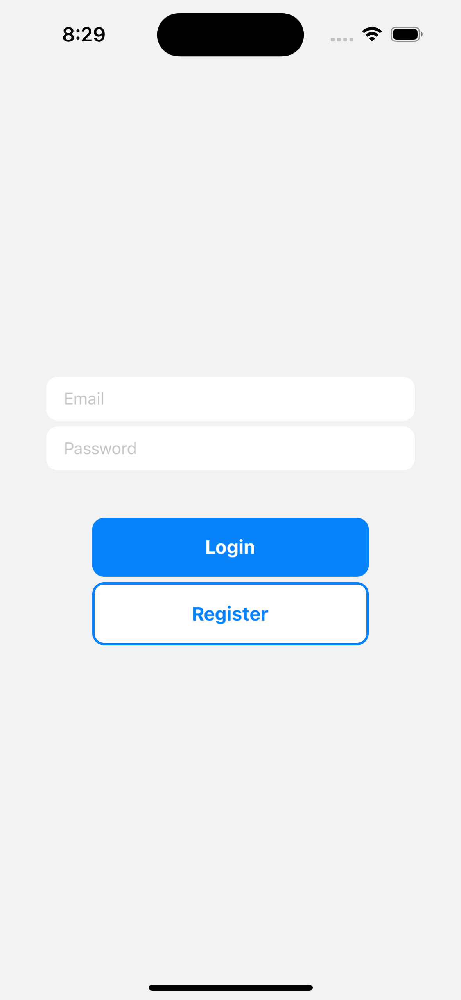
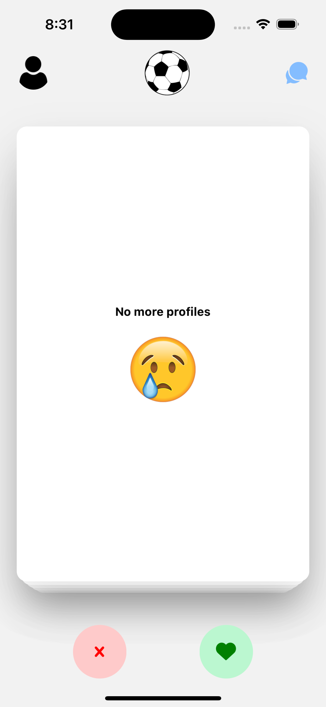
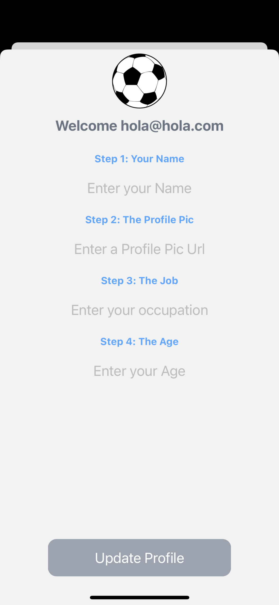

# Sport Mate Finder App

## Description

The Sport Mate Finder App is a React Native mobile application that provides a platform for users to connect with potential partners for sports and fitness activities. Whether you're looking for a jogging buddy, a tennis partner, or someone to hit the gym with, this app is designed to help you find like-minded individuals who share your passion for staying active and healthy.

## Features

- **Swipe-to-Match**: Similar to popular dating apps like Tinder, you can browse through user profiles and swipe right to connect with someone who shares your interest in a particular sport or fitness activity.

- **Chat**: Once you've matched with a potential sports partner, you can use the in-app chat feature to communicate, plan workouts, and coordinate meetups.

- **Profile Customization**: Create and personalize your user profile with details about your favorite sports, fitness goals, and availability.

- **Location-Based Matching**: The app uses location services to find sports partners in your area, making it easy to find someone nearby to exercise with. (TO DO)

- **Notifications**: Receive real-time notifications when you have new messages or match with a fellow sports enthusiast. (TO DO)

## Screenshots

    
    

    
    

## Demo

See the Sports Partner Finder App in action:

